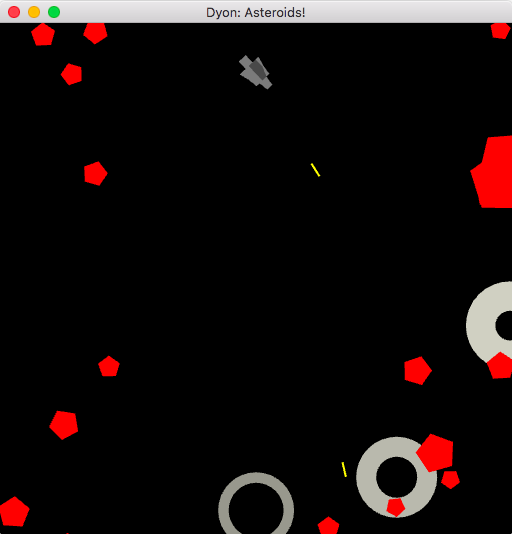

# dyon_asteroids
A demo game project for Dyon/Piston/Glium to test Dyon and research design for dyon_interactive

Current screenshot (work in progress):

### How to install and run

The demo game is in early development stage and Dyon has not yet added a feature for shipping binaries.
This means you need to compile the engine and run it from source:

1. Install [Rust](https://www.rust-lang.org/)
1. Fork the repo
2. Open up the Terminal window and go the project directory
3. Type `cargo run --release`
